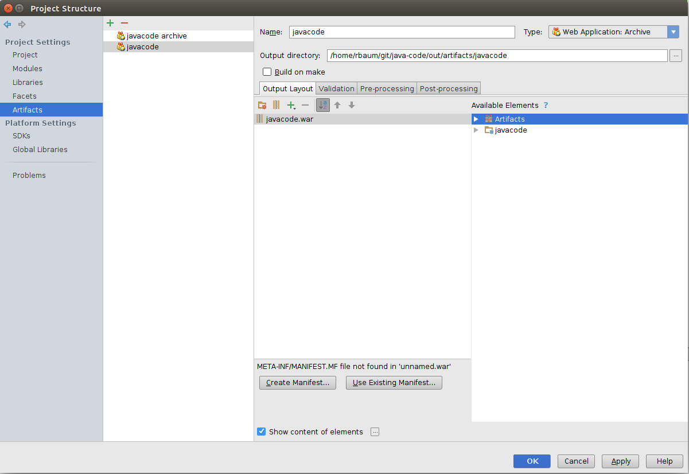
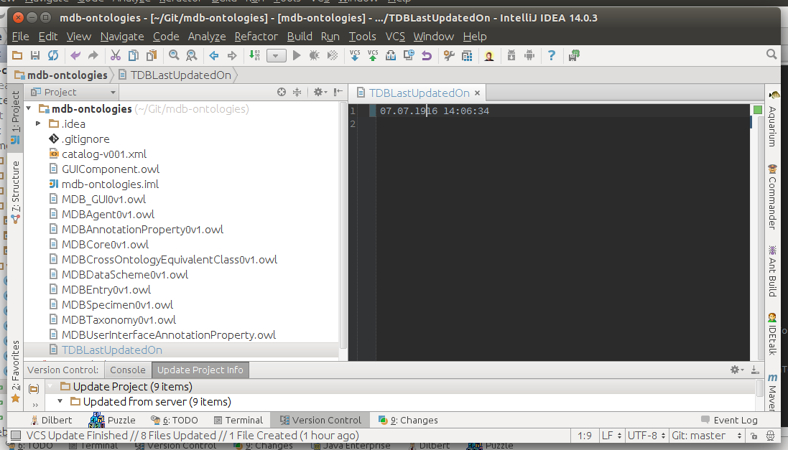
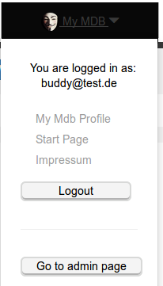
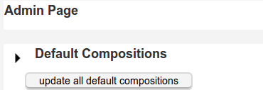

# MDB Java Backend

## Installation

#### Get GIT repository:
You obviously already have the code from
https://github.com/MorphDBase/MDB-prototype
:-)

#### Create artifact via IDEA:

    IDEA -> File -> Project Structure -> Artifacts -> green plus sign -> Web Application: Archive

Change the name of the web archive for example to "javacode" and press **Apply** and afterwards **OK**.

## Running the app

### Updating web archive(.war) :

First you have to create a web archive.

    IDEA -> Build -> Build Artifacts -> javacode -> Build

Afterwards copy the new web archive to the server

    scp -r /path/to/archive/javacode.war  morphdbase_git:/home/path/to/mdb_warfiles/

At last restart the websocket.

### Updating ontologies :

**Open IDEA**

Open file **loadFileInTDB.java**

change date in Project „mdb-ontologies“ in file "TDBLastUpdatedOn"

    mdb-ontologies -> TDBLastUpdatedOn

from _20xx_ to _19xx_.

Open two terminals

Login to Server in first terminal

    sudo chown -R user:user /home/path/to/tdb/
    rm -r /home/path/to/tdb/MDB_ontology_workspace/*

Push new generated ontologies to server in second terminal

    scp -r /home/path/to/tdb/MDB_ontology_workspace/*  morphdbase_git:/home/path/to/tdb/MDB_ontology_workspace

Assign directory to jetty in first terminal

    sudo chown -R jetty:jetty /home/path/to/tdb/

**Restart the websocket**

Login to https://proto.morphdbase.de .

Go to https://proto.morphdbase.de/admin (click " **Go to admin page**" under " **My MDB**")

Lastly click "update all default compositions" at the internal admin page.

### Restart websocket :

    cd /opt/jetty/
    sudo supervisorctl restart jetty-mdb

Click on the bottom Application Servers and then the green play sign on the left site in the new window.

Any Problems? Ask me!

